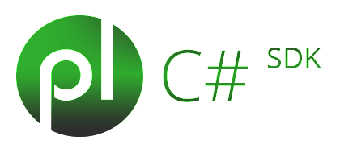
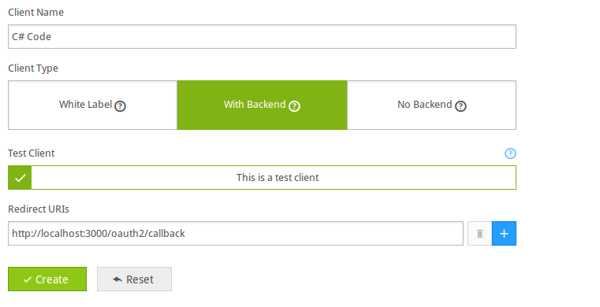

Playlyfe C# SDK[](http://badge.fury.io/nu/playlyfe)
=================
This is the official OAuth 2.0 C# client SDK for the Playlyfe API.
It supports the `client_credentials` and `authorization code` OAuth 2.0 flows.
For a complete API Reference checkout [Playlyfe Developers](https://dev.playlyfe.com/docs/api.html) for more information.

> Note: Breaking Changes this is the new version of the sdk which uses the Playlyfe api v2 by default if you still want to use the v1 api you can do that so by passing a version key in the options when creating a client with 'v1' as the value

```csharp
var playlyfe = new Playlyfe(
    client_id: "Your client id",
    client_secret: "Your client secret",
    type: "code",
    store: null,
    load: null,
    version: "v1"
);
```

Requires
--------
.NET >= 4.0 or Mono >= 3.2.8

Install
----------
You can direcly download the `playlyfe.dll` file and reference it in your project
or if you are using nuget
```csharp
nuget install playlyfe
```

Using
-----
### Create a client
  If you haven't created a client for your game yet just head over to [Playlyfe](http://playlyfe.com) and login into your account, and go to the game settings and click on client

  **1.Client Credentials Flow**
    In the client page click on whitelabel client
    

  **2.Authorization Code Flow**
    In the client page click on backend client and specify the redirect uri this will be the url where you will be redirected to get the token
    

> Note: If you want to test the sdk in staging you can click the Test Client button.

  And then note down the client id and client secret you will need it later for using it in the sdk

# Examples
The Playlyfe class allows you to make rest api calls like GET, POST, .. etc.  
To get started initialize your client using client credentials flow and then start making requests
**For v1 api**
```csharp
var playlyfe = new Playlyfe(
    client_id: "Your client id",
    client_secret: "Your client secret",
    type: "client",
    store: null,
    load: null,
    version: "v1"
);
// This will take your client id and secret and use it to fetch the access token to make further requests.

// To get infomation of a  player
dynamic player = playlyfe.get(
  route: "/player",
  query: new Dictionary<string, string> () { {"player_id", "student1" }}
);
Console.WriteLine(player["id"]);
Console.WriteLine(player["alias"]);

// To get all available processes
dynamic processes = playlyfe.get(
  route: "/processes",
  query: new Dictionary<string, string> () {{"player_id", "student1"}}
)
Console.WriteLine(processes["total"]);
// To start a process
dynamic process =  playlyfe.post(
  route: "/definitions/processes/collect",
  query: new Dictionary<string, string> () { {"player_id", "student1"} },
  body: new { name = "My First Process" }
);

//To play a process
playlyfe.post(
  route: "/processes/"+process_id+"/play",
  query: new Dictionary<string, string> () { {"player_id", "johny"} },
  body: new { trigger = trigger_name }
);

// A PLaylyfeException is thrown when an error from the playlyfe platform is returned on a request
try {
  playlyfe.get(
    route: "/unkown",
    query: new Dictionary<string, string>(){ {"player_id", "student1"}}
  );
}
catch(PlaylyfeException err) {
  Console.WriteLine (err.Name); // route_not_found
  Console.WriteLine (err.Message); // This route does not exist
}
```
**For v2 api**
```csharp
var playlyfe = new Playlyfe(
    client_id: "Your client id",
    client_secret: "Your client secret",
    type: "code",
    store: null,
    load: null
);
// This will take your client id and secret and use it to fetch the access token to make further requests.

// To get infomation of a  player
dynamic player = playlyfe.get(
  route: "/runtime/player",
  query: new Dictionary<string, string> () { {"player_id", "student1" }}
);
Console.WriteLine(player["id"]);
Console.WriteLine(player["alias"]);

// To get all available processes
dynamic processes = playlyfe.get(
  route: "/runtime/processes",
  query: new Dictionary<string, string> () {{"player_id", "student1"}}
)
Console.WriteLine(processes["total"]);
// To start a process
dynamic process =  playlyfe.post(
  route: "/runtime/processes",
  query: new Dictionary<string, string> () { {"player_id", "student1"} },
  body: new { name = "My First Process", definition = "module1" }
);

//To play a process
playlyfe.post(
  route: "/runtime/processes/"+process_id+"/play",
  query: new Dictionary<string, string> () { {"player_id", "johny"} },
  body: new { trigger = trigger_name }
);

// A PLaylyfeException is thrown when an error from the playlyfe platform is returned on a request
try {
  playlyfe.get(
    route: "/unkown",
    query: new Dictionary<string, string>(){ {"player_id", "student1"}}
  );
}
catch(PlaylyfeException err) {
  Console.WriteLine (err.Name); // route_not_found
  Console.WriteLine (err.Message); // This route does not exist
}
```
# Examples for [Nancy Framework](http://nancyfx.org/)
## 1. Client Credentials Flow
A typical nancy app using client credentials code flow with a single route would look something like this
```csharp
    public class Client : NancyModule
    {
        public static Playlyfe plClient = null;
        public Client ()
        {
            if (plClient == null)
                plClient = new Playlyfe (
                    client_id: "Zjc0MWU0N2MtODkzNS00ZWNmLWEwNmYtY2M1MGMxNGQ1YmQ4",
                    client_secret: "YzllYTE5NDQtNDMwMC00YTdkLWFiM2MtNTg0Y2ZkOThjYTZkMGIyNWVlNDAtNGJiMC0xMWU0LWI2NGEtYjlmMmFkYTdjOTI3",
                    type: "client",
                    store: null,
                    load: null,
                    version: "v1"
                );
            Get["/client"] = parameters => {
                dynamic players = plClient.get(route: "/game/players", query: null);
                return listAllPlayers(players);
            };
        }

        public static String listAllPlayers(dynamic players)
        {
            var html = "<ul>";
            foreach(dynamic player in players["data"]) {
                html += "<li><p>";
                html += "<bold>Player ID</bold>:   "+ player["id"];
                html += "<bold>Player Alias</bold>:    "+ player["alias"];
                html += "</p></li>";
            }
            html += "</ul>";
            return html;
        }
    }
```
## 2. Authorization Code Flow
In this flow you will have a route which will get the authorization code and using this the sdk can get the access token. You need a view which will allow your user to login using the playlyfe platform. And then playlyfe server will make a get request with the code to your redirect uri. And you should find the code in the query params of the url and exchange the code with the Playlyfe SDK.
```csharp
exchange_code(code)
```

> Host your ASP.NET server with ip address localhost:3000

Now you should be able to access the Playlyfe api across all your
routes.
```csharp
    public class Code : NancyModule
    {
        public static Playlyfe plCode = null;
        public static string user = null;
        public Client ()
        {
            if(plCode == null)
                plCode = new Playlyfe(
                    client_id: "OGUxYTRlZWUtZTAyOS00ZThjLWIyNzQtNGEwMGRiNjk1ZGRj",
                    client_secret: "NDMyMDMyOTktM2NhOS00MGJlLTg4NzYtZWJjMzNhNTE1NDYwYTc1NGU2NTAtNWI1ZS0xMWU0LTkwYTEtYTM4MzkzMzkxZTY1",
                    type: "code",
                    redirect_uri: "http://localhost:3000/code",
                    store: null,
                    load: null,
                    version: "v1"
                );
            Get ["/code"] = parameters => {
                var dict = (DynamicDictionary) this.Request.Query;
                if(dict.ContainsKey("code")) {
                    plCode.exchange_code(dict["code"].ToString());
                    user = "logged_in";
                }
                if(user != null)
                {
                    dynamic players = plCode.get(route: "/game/players", query: null);
                    return listAllPlayers(players);
                }
                else {
                    return "<a href=\""+ plCode.get_login_url() + "\">Please Login to your Playlyfe Account</a>";
                }
            };

            Get ["/logout"] = parameters => {
                user = null;
                return "logged_out";
            };
        }
    }
```
# Documentation
You can initiate a client by giving the client_id and client_secret params
```csharp
Playlyfe(
    client_id: "Your client id",
    client_secret: "Your client secret",
    type: "client" or "code",
    redirect_uri: "The url to redirect to" //only for authorization code flow
    store: token => { Console.WriteLine("storing"); }  // The lambda which will persist the access token to a database. You have to persist the token to a database if you want the access token to remain the same in every request
    load:  delegate {
        var dict = new Dictionary<string, string>() {
            "access_token", "my access token",
            "expires_at", "expires_at_time"
        };
        return dict;
    } // The lambda which will load the access token. This is called internally by the sdk on every request so that the access token can be persisted #between requests
)
```
In development the sdk caches the access token in memory so you don"t need to provide the store and load lambdas/delegates. But in production it is highly recommended to persist the token to a database. It is very simple and easy to do it with redis. You can see the test cases for more examples.
```csharp
    new Playlyfe(
      client_id: "Your client id",
      client_secret: "Your client secret",
      type: "client",
      store: null,
      load: null
    )
```

**API**
```csharp
dynamic api(
    method: "GET" // The request method can be GET/POST/PUT/PATCH/DELETE
    route: "" // The api route to get data from
    query: Dictionary<string, string> // The query params that you want to send to the route
    raw: false // Whether you want the response to be in raw string form or json
)
```

**Get**
```csharp
dynamic get(
    route: "" // The api route to get data from
    query: Dictionary<string, string> // The query params that you want to send to the route
    raw: false // Whether you want the response to be in raw string form or json
)
```
**Post**
```csharp
dynamic post(
    route: "" // The api route to post data to
    query: Dictionary<string, string> // The query params that you want to send to the route
    body: new {} // The data you want to post to the api this will be automagically converted to json
)
```
**Patch**
```csharp
dynamic patch(
    route: "" // The api route to patch data
    query: Dictionary<string, string> // The query params that you want to send to the route
    body: new {} // The data you want to update in the api this will be automagically converted to json
)
```
**Put**
```csharp
dynamic put(
    route: "" // The api route to put data
    query: Dictionary<string, string> // The query params that you want to send to the route
    body: new {} // The data you want to update in the api this will be automagically converted to json
)
```
**Delete**
```csharp
dynamic delete(
    route: "" // The api route to delete the component
    query: Dictionary<string, string> // The query params that you want to send to the route
)
```
**Get Login Url**
```csharp
string get_login_url()
//This will return the url to which the user needs to be redirected for the user to login. You can use this directly in your views.
```

**Exchange Code**
```csharp
void exchange_code(string code)
//This is used in the auth code flow so that the sdk can get the access token.
//Before any request to the playlyfe api is made this has to be called atleast once.
//This should be called in the the route/controller which you specified in your redirect_uri
```

**Errors**  
A ```PlaylyfeException``` is thrown whenever an error occurs in each call.The Error contains a Name and Message field which can be used to determine the type of error that occurred.

Author
======
[Peter John](https://github.com/pyros2097)  

Contributors
============
[Kumar Harsh](https://github.com/kumarharsh)  
[Rafael Kato](https://github.com/rafakato)  

License
=======
Playlyfe C# SDK v0.4.1  
http://dev.playlyfe.com/  
Copyright(c) 2013-2014, Playlyfe IT Solutions Pvt. Ltd, support@playlyfe.com

Permission is hereby granted, free of charge, to any person obtaining a copy
of this software and associated documentation files (the "Software"), to deal
in the Software without restriction, including without limitation the rights
to use, copy, modify, merge, publish, distribute, sublicense, and/or sell
copies of the Software, and to permit persons to whom the Software is
furnished to do so, subject to the following conditions:

The above copyright notice and this permission notice shall be included in
all copies or substantial portions of the Software.

THE SOFTWARE IS PROVIDED "AS IS", WITHOUT WARRANTY OF ANY KIND, EXPRESS OR
IMPLIED, INCLUDING BUT NOT LIMITED TO THE WARRANTIES OF MERCHANTABILITY,
FITNESS FOR A PARTICULAR PURPOSE AND NONINFRINGEMENT. IN NO EVENT SHALL THE
AUTHORS OR COPYRIGHT HOLDERS BE LIABLE FOR ANY CLAIM, DAMAGES OR OTHER
LIABILITY, WHETHER IN AN ACTION OF CONTRACT, TORT OR OTHERWISE, ARISING FROM,
OUT OF OR IN CONNECTION WITH THE SOFTWARE OR THE USE OR OTHER DEALINGS IN
THE SOFTWARE.
